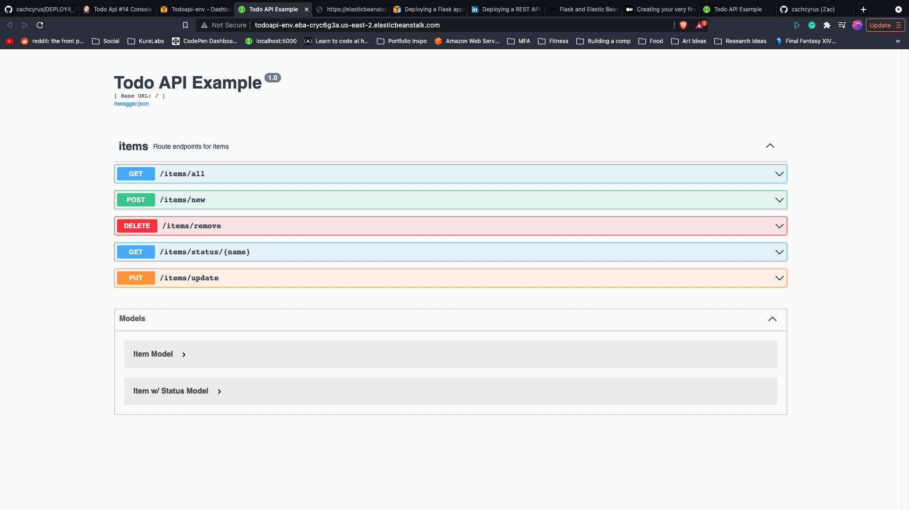

# HW-todo-api

## Summary

This is a To-Do API built with python flask connected to a SQLite database, built following a REST architecture design. The API will allow users to perform create, read, update, and delete(CRUD) operations on an item resource. The item resource consists of the name of the item as well as the status of the item.

## Additions 

Added a Swagger UI interface through the flask restx extension of python flask. This allows users to quickly interact with the UI, and learn how to properly use it. 

### Links
[Tutorial this was based off of](https://stackabuse.com/building-a-todo-app-with-flask-in-python/)

[Github Repo where my code is stored](https://github.com/zachcyrus/todo-list)
